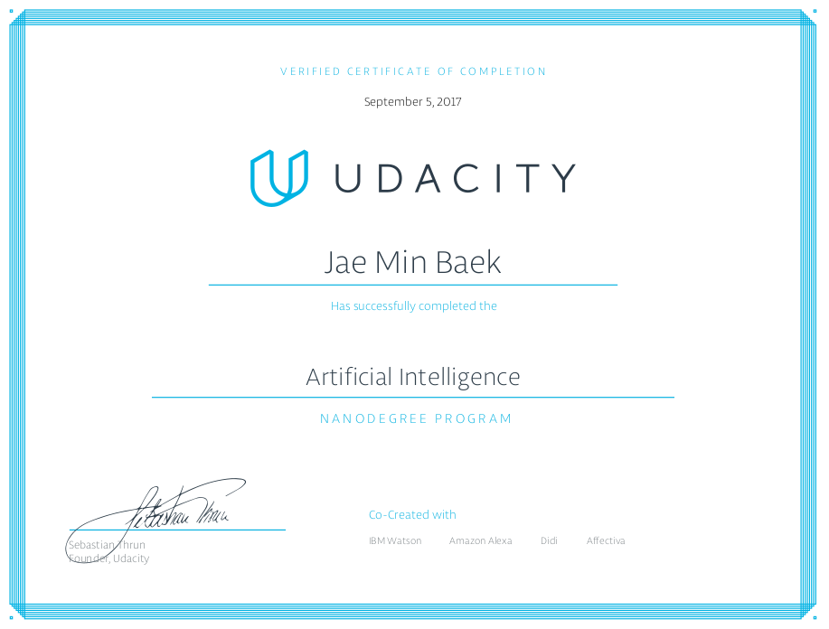

# Udacity - [Artificial Intelligence Nanodegree](https://www.udacity.com/course/artificial-intelligence-nanodegree--nd889)

AI nanodegree is to master skills and tools used by the most innovative AI teams across the globe as you delve into specializations, and gain experience solving real-world challenges. 

**Topics include:** 
- Search and Optimization 
- Logic, Reasoning, and Planning
- Building Models of Probability
- Natural Language Processing
- Computer Vision
- And much more!

**Co-Created by**

&nbsp;&nbsp;&nbsp;&nbsp;&nbsp;&nbsp;&nbsp;&nbsp;&nbsp;&nbsp;&nbsp;&nbsp;&nbsp;&nbsp;&nbsp;

---

# Foundations of AI - Term 1
## Projects and Labs

1. [Solve a Sudoku with AI](https://github.com/jbaek7023/SudokuGameSolver)
2. [Build a Game-Playing Agent](https://github.com/jbaek7023/AIND-Isolation)
3. Lab: Teaching Pac-Man to Search
4. Lab: Simulated Annealing
5. Lab: Constraint Satisfaction N-Queens
6. [Implement a Planning Search](https://github.com/jbaek7023/AIND-CargoProject)
7. [Build a Sign Language Recognizer](https://github.com/jbaek7023/AIND-Recognizer)

# Deep Learning and Applications - Term 2
## Projects and Labs
1. Lab: MNIST
2. Lab: IMDB
3. Lab: CIFAR-10
4. [CNN Dog Breed Classifier](https://github.com/jbaek7023/AIND-Dog-Recognizer)
5. [RNN Apple Stock & Sherlock Holmes](https://github.com/jbaek7023/AIND-RNNs)
6. Lab: Affectiva SDK - Mimic Me!
7. [Facial Keypoint Detection](https://github.com/jbaek7023/Facial-Keypoint-Detection)

# Course Overview 
##### Term 1

- Welcome to the AI Nanodegree
- Setting up with Anaconda
- Solving a Sudoku with AI
- Introduction to AI
- Introduction to Game Playing
- Advanced Game Playing
- Search
- Simulated Annealing
- Constraint Satisfaction
- Logic and Reasoning
- Planning
- Probability
- Bayes Nets
- Inference in Bayes Nets
- Hidden Markov Models

##### Term 2

- Deep Neural Networks
- Convolutional Neural Networks
- CNN Project: Dog Breed Classifier
- Intro to TensorFlow
- Autoencoders
- Recurrent Neural Networks
- Long Short-Term Memory Networks (LSTM)
- Implementing RNNs and LSTMs
- Hyperparameters
- Sentiment Prediction with RNN
- RNN Project: Time Series Prediction and Text Generation
- Generative Adversarial Networks
- Deep Convolutional GANs
- Semisupervised Learning

##### Concentration

- Intro to Computer Vision
- Mimic Me!
- Image Representation and Analysis
- Image Segmentation
- Features and Object Recognition

